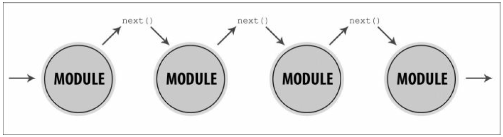

## Node.js fundamentals

### 重点

* Node.js基础
* 在modules中组织代码逻辑
* 理解跨模块沟通
* 异步编程
* 探索中间件架构
* 组成与继承
* 管理依赖

### Node.js基础

Node.js是单线程技术。这就意味着每次请求都是但是单线程处理。在其他语言中，例如Java和Web服务每次请求都会实例化一个新的线程。然而，这也意味着Node.js使用异步处理，其中有一个原理，使它单线程工作带来友好呈现。单线程应用的问题是I/O运行阻塞；例如， 当我们需要从硬盘上读取文件响应客户端时。 一旦一次新的请求登录服务器，我们就会打开文件并读取，那么问题就会发生在另一个随机的请求上，应用仍然在第一个请求上进行。让我们用下面的例子来阐明这个问题：

```
var http = require("http");

var getTime = function() {
	var d = new Date();
	return d.getHours() + ":" + d.getMinutes() + ":" + d.getSeconds() + ":" +d.getMilliseconds();
};
var respond = function(res, str) {
	res.writeHead(200, {"Content-Type":"text/plain"});
	res.end(str +"\n");
	console.log(str + " " + getTime());
};
var handleRequest = function(req, res) {
	if (req.url === "/favicon.ico") {
		return;
	}
	console.log("new request: " + req.url + "  - " + getTime());

	if (req.url == "/immediately") {
		respond(res, "A");
	} else {
		var now = new Date().getTime();
		while(new Date().getTime() < now + 5000) {
			// synchronous reading of the file
		}
		respond(res, "B");
	}

};

http.createServer(handleRequest).listen(88, "127.0.0.1");
```

第一行初始化的http模块是用来运行web服务。getTime方法以字符串形式返回当前时间，respond方法向客户端浏览器发送简单的文本来报告进来的请求已经被处理。最有趣的方法是handleRequest，这是逻辑的入口点。创建一个为期5秒的while循环来模拟读取大文件。一旦运行服务，我们将能够作出HTTP请求到http://localhost:88。为演示单线程行为我们将同时发送两条行为。如下请求：

* 探索中间件架构
* 组成与继承
* 管理依赖

下面的截图是在检测两条url之后从服务器上打印输出的：


正如我们所看到的，第一条请求在13:57:11:66，响应时间在13:57:16:68，正是5秒之后。然而问题就在于当第一次请求完成之后第二次请求才被注册。这是因为第一次请求时Node.js线程正忙于处理while循环。
当然，Node.js有解决这种I/O运行阻塞的方案。将他们转换成异步运行并接受回调。一旦运行完成，Node.js就移除回调，并通知这项工作已被处理。这种途径的好处就是当在等待获取I/O的结果时，服务器可以处理另外一条请求。处理外部事件并将这些转换成回调调用的实体被称为event循环。event循环充当一个非常好的管理者并且分配任务给不同的工作者。异步从不堵塞，并且只是等待事情的发生，例如一条文件写入成功的通知。
现在，取代同步文件读取方式，我们使用异步代码改变我们的上诉例子。修改过的代码看起来像下面的代码：

```
var http = require("http");

var getTime = function() {
	var d = new Date();
	return d.getHours() + ":" + d.getMinutes() + ":" + d.getSeconds() + ":" +d.getMilliseconds();
};
var respond = function(res, str) {
	res.writeHead(200, {"Content-Type":"text/plain"});
	res.end(str +"\n");
	console.log(str + " " + getTime());
};
var handleRequest = function(req, res) {
	if (req.url === "/favicon.ico") {
		return;
	}
	console.log("new request: " + req.url + "  - " + getTime());

	if (req.url == "/immediately") {
		respond(res, "A");
	} else {
		setTimeout(function() {
			// reading the file
			respond(res, "B");
		}, 5000);
	}

};
```
第一条请求仍然是在5秒后得到响应结果，然而，第二条请求在第一条请求后立刻发出。

#### 在modules中组织代码逻辑

如果我们要写很多代码，迟早会意识到我们的逻辑应该被分成到不同的模块中。在很多语言中，通过类和包来这么做，或者其他语言标准。然而，在JavaScript中，自身并没有类。所有都是对象，在实践中，对象继承对象。在JavaScript中，有几种方式来完成面向对象实现。可以使用原型继承、文本对象或者回调函数。感激的是，Node.js有标准化的方式来定义模块。这个方式就是通过实现CommonJS达成的，CommonJS是一个指定为JavaScript的生态系统的项目。

因此，你想通过提供有用的api方法来封装你的逻辑。如果你能到达这一刻，那么你绝对是在正确的方向。这是很重要的，也许这就是现如今项目中最具挑战性的方面。分解业务和分配功能的功能的能力不总是简单的任务。往往，这种任务被低估了，但是这是良好架构的关键。如果一个模块包含很多依赖关系，使用不同的数据存储操作，或有几种责任，那么，我们很容易犯错。这样的代码不会测试通过的，并且难以维护。即使我们很小心这两样，但代码仍然难以继承和继续使用。这就是为什么为不同的模块定义不同的功能的好处了。在Node.js中通过exports关键字定义模块，参考于module.exports。

#### 创建一个汽车结构应用

使用简单的例子来阐述这个过程。假设我们要建一个构造汽车的应用。我们需要主模块（car）和其他模块，不同模块管理小车的不同部分（轮子、窗户、门等等）。先从定义小车轮子的模块开始，代码如下：

```
// demo3-wheels.js
var typeOfTires;
exports.init = function(type) {
	typeOfTires = type;
}
exports.info = function() {
	console.log("The car uses " + typeOfTires + " tires.");
}
```

上面的代码是demo3-wheels.js的组成部分。包含两个方法。init方法首先会被调用，设置轮胎的类型。info方法只是简单的输出信息。在主文件demo3-car.js中，我们需要使用已提供的api方法获取一个轮子实例。代码如下：

```
// demo3-car.js
var wheels = require("./demo3-wheels.js");
wheels.init("winter");
wheels.info();
```
当你用node demo3-car.js命令运行上面的代码，你将得到下面的输出：


因此，你想要向外展现的任何事物都应赋予导出对象。注意，typeOfTires是模块内部变量，只能在demo3-wheels.js起作用，而不是car.js。直接应用对象或方法到接口对象是常见的，如下代码：

```
// demo3-engine.js
var Class = function() {
	// ...
};
Class.prototype = {
	forward: function() {
		console.log("The car is moving forward.");
	},
	backward: function() {
		console.log("The car is moving backward.");
	}
}
module.exports = Class;
```

在JavaScript中，一切都是对象，每一个对象都有一个prototype（原型）属性。prototype就像一个存储器，保存可访问变量和方法。在JavaScript继承当中，prototype被大量使用，这是因为它提供逻辑转移机制。

我们将会理清一下module.exports和exports之间的区别。正如你所看到的，demo3-wheels.js中，我们直接为全局exports接口对象分配了init和info两个方法。事实上，exports是module.exports的一个参照，每一个依附于exports的方法或变量对外界都是可访问的。然而，如果我们直接为export对象分配新对象或者方法时，我们不应该在文件加载requiring进来后期望得到他的访问权。这时应该用module.exports。如下：

```
// demo4-file.js
module.exports.a = 10;
exports.b = 20;
// demo4-app.js
var file = require("./demo4-file");
console.log(file.a, file.b);
```

app.js和file.js，在同一个目录下。如果运行node app.js，将会得到10和20的结果。然而，考虑到在改变demo4-file.js文件将会发生的事情，代码如下：

```
// demo5-file.js
module.exports = { a: 10 };
exports.b = 20;
```
在这个案例中我们将得到10和 undefined 结果。这是因为module.exports被分配了新的对象，而exports仍然指向原来的。

#### 使用汽车发动机

现在讲讲控制汽车模块的的demo6-engine.js。他有向前移动和向后移动的功能。因为逻辑被定义在单独的类中，并且类作为module.exports的值直接被传递，所以是有点不同的。此外，当我们导入一个功能而不是一个对象时，我们的变量应该用关键字new创建。我们将会看到车子使用new关键字如何起作用的，代码如下：

```
// demo6-engine.js
var Engine = require("./demo3-engine");
var e = new Engine();
e.forward();
```

通过所需方法来返回模块，Node.js对其进行缓存。这样做的目的是阻止循环事件的阻塞以及增强呈现。这是同步操作的，如果没有缓存，Node.js将会重复相同的工作。通过一个文件夹的名字调用方法是比较好的，但是应该有一个package.json或者一个index.js文件在目录里面。在Node.js官方文档[(http://nodejs.org)](http://nodejs.org)中,所有的机制都被很好的描述。需要注意的是，Node.js环境鼓励模块化编程。所有我们所需要的自带实现都在系统中，没必要使用第三方提供的模块。

就像客户端代码，每一个Node.js模块都可以被继承。同样，正如在普通的JavaScript中我们也要写代码，我们可以使用众所周知的继承。如下：

```
// demo6-engine.js
var Engine = require("./demo3-engine");
var e = new Engine();
e.forward();
```

Node.js事件为此提供有用的方法。现在讲讲，当我们想继承demo3-engine.js类和添加API方法在左右两个方向移动。可以像下面的代码一样：

```
// demo7-control.js
var util = require("util");
var Engine = require("./engine.js");
var Class = function() {}
util.inherts(Class, Engine);
Class.prototype.left = function() {
	console.log("The car is moving to left.");
};
Class.prototype.right = function() {
	console.log("The car is moving to right");
};
module.exports = Class;
```

第一行获取一个参考到Node.js自带的utils模块。这个非常有用。第四行就是奇迹的发生。通过条用inherits方法，可以设置Class对象的新属性。记住每个新方法应该使用已经应用的属性。这就是为什么left和right在继承之后才被定义。最后，我们的车将可以在4个方向移动，如下：

```
// demo7-move.js
var Control = require("./demo7-control.js");
var c = new Control();

c.forward();
c.right();
```

### 理解跨模块沟通

 我们已经找出如何将我们的代码逻辑化成模块。我们现在需要知道如何使他们相互通信。往往，人们将Node.js描述成事件驱动系统。由于我们已经在前面章节中看到了，Node.js在之前的请求完成之前可以接受一个新的请求事件，因此它也被称为无阻塞。这正是高效和可扩展性的体现。这些事件非常强大，并且告诉其他模块正在进行的一切。他们带来封装，这在模块化编程中非常重要。让我们添加一些事件到汽车案例中，这个案例之前有讨论过的。比方说，我们有空调，我们需要知道什么时候开启它。这样逻辑实现包含两部分。第一部分是空调模块。需要发送一个事件来指明动作的开始。第二部分是其他的代码来监听开始动作。我们将创建一个新的air.js文件，包含逻辑响应空调。代码如下

```
// demo8-air.js
var util = require("util");
var EventEmitter = require("events").EventEmitter;
var Class = function() {}
util.inherits(Class, EventEmitter);
Class.prototype.start = function() {
	this.emit("started");
};
module.exports = Class;
```

我们的类继承了Node.js的EventEmitter模块。它包含如emit和on等方法，这些方法帮助我们建立基础事件通信。只有一种自定义方法：start。这是一个简单的事件触发以表明空调被开启。代码如下：

```
// demo8-car.js
var AirConditioning = require("./demo8-air.js");
var air = new AirConditioning();
air.on("started", function() {
	console.log("Air conditionning started");
});
air.start();
```
这个例子向我们展示了模块之间的通信。因为封装，这些都变得非常强大。这个模块知道自己的职责，而且对系统中的其他部分运行不感兴趣。它简单的做着自己的工作，并发送通知。例如，在之前的代码中，AirConditioning类并不知道自己开启之后我们要输出信息。他只知道一部分事件要被发送。

往往，在发射器事件中我们需要发送一个数据。这是很简单的，我们只需根据事件的名字传递另一个参数。这里我们就展示了如何发送一个status属性：

```
Class.prototype.start = function() {
	this.emit("started", { status: "cold" });
};
```

连接到该事件的对象包含一些关于空调模块的信息。在监听事件中，相同的对象将可利用。下面的代码块向我们展示了如何获取status变量的值：

```
air.on("started", function(data) {
	console.log("Status: " + data.status);
});
```

有一个设计模式描述的是过程。被称为Observer。在这个模式的上下文中，空调模块被称为subject，汽车模块被称为observer。Subject转播信息和事件给观察者，告诉他们有事情发生了。

如果需要移除一个监听器，Node.js有一个叫做removeListener。我们甚至允许标准的观察者使用setMaxListeners。总体而言，这些事件是最好的方式之一来疏导你的逻辑部分。最主要的好处是隔离模块，但是仍然和你的应用其他部分具有高度联系。

### 异步编程

正如我们所了解的，在无阻塞的环境中，例如Node.js，大部分处理都是异步的。一个请求来到我们的代码，我们的服务开始处理他，但是同时继续接受新的请求。例如，下面的文件读取：

```
// demo9.js
fs.readFile("page.html", function(err, content) {
	if (err) {
		throw err;
	}
	console.log(content);
});
```

readFile方法接受两个参数。第一个参数是所要读文件路径名，第二个参数则是一个方法，会在运行之后被调用。即使读取失败，回调反馈也会被解除。此外，由于每一件事都可以通过异步完成，也许结束会反馈一个很长的链接。对于这个有一个专门的术语——回调域。为了阐述这个问题，将会扩展之前的例子，使用文件内容来做一些操作，如下：

```
// demo9-1.js
fs.readFile("page.html", function(err, content) {
	if (err) {
		throw err;
	}
	getData(function(data) {
		applyDataToTheTemplate(content, data, function(resultedHTML) {
			renderPage(resultedHTML, function() {
				showPage(function() {
					// finally, we are done
				});
			});
		});
	});
});
```

如你所见，我们的代码看起来很糟糕。读起来和理解都很困难。有几十种工具可以帮助我们避免这种情况。然而，我们自己可以解决这种问题。首先要认识到这个问题。如果我们有超过四到五个嵌套回调，那么我们一定要重构我们的代码。使事情变得简单通常会带来很多帮助，那就使代码变得浅显易懂吧。之前的代码可以整理成更加友好和可读性的格式。例如，以下的代码：

```
// demo9-2.js
var onFileRead = function(content) {
	getData(function(data) {
		applyDataToTheTemplate(content, data, dataApplied);
	});
}
var dataApplied = function(resultedHTML) {
	renderPage(resultedHTML, function() {
		showPage(weAreDone);
	});
}
var weAreDone = function() {
	// finally, we are done
}
fs.readFile("page.html", function(err, content) {
	if(err) throw err;
	onFileRead(content);
});
```

大部分的回调都是被独立定义的。因为方法的名字的描述，所以很清楚的知道正在发生的什么。然而，在很多复杂的情况下，由于你需要定义很多方法，这些技术也许不起作用。如果这就是问题所在，那么，在额外的模块中联合这些方法。如下：

```
// demo9-3.js
var renderTemplate = require("./renderTemplate.js");
renderTemplate("page.html", function() {
	// we are done.
});
```

你仍然需要一个回调，但是看起来就像是帮助器被隐藏并且只有主要功能是可见的。
对于处理异步代码，另一个流行的的工具是promises 范例。我们已经讨论过JavaScript中的事件，promises类似这些。我们仍然等待一些事情的发生，和传递回调。可以说promises所代表的一个值是不可以即刻得到的，但是在未来可以得到。promises的语法使得异步代码看起来像同步的。如下，加载Twitter feed的模块：

```
// demo9-4.js
var TwitterFeed = require("TwitterFeed");
TwitterFeed.on("loaded", function(err, data) {
	if(err) {
		// ...
	} else {
		// ...
	}
});
TwitterFeed.getData();
```

以上代码为loaded事件添加一个监听器，调用getData方法，这个方法是连接到Twitter以及获取信息的。如下：

```
// demo9-5.js
var TwitterFeed = require("TwitterFeed");
var promise = TwitterFeed.getData();
promise.then(function(data) {
	// ...
}, function(err) {
	// ...
});
```

promise对象代表我们的数据。当promise对象成功时，第一个发送到then的方法会被调用。注意，在调用getData方法之后回调被注册。这就意味着对于获取数据的过程我们并不严格。我们对行为什么时候发生并不感兴趣。我们只关心什么时候完成以及结果是什么。我们可以从基于实现事件中发现不同之处。如下：

+ 处理错误的独立方法
+ 在调用then方法之前getData方法可以被调用。然而同样的事情是不可能的事件。在逻辑运行之前我们需要赋予监听器。另外，如果我们的任务是异步，15:26也许在我们监听赋予之前就被发送出去。
+ promise方法可以只失败或成功一次，然而特定的事件可以被解除多次，他的处理事件也可以被调用多次。

promises真正派上用场的时候是我们把它们连接起来。为了阐述这一点，我们将使用相同的例子并保存tweets到一个数据库，代码如下：

```
// demo9-6.js
var TwitterFeed = require("TwitterFeed");
var Database = require("Database");
var promise = TwitterFeed.getData();
promise.then(function(data) {
	var promise = Database.save(data);
	return promise;
}).then(function() {
	// the data is saved
	// into the database
}).catch(function(err) {
	// ...
});
```

如果回调成功并返回一个新的promise，我们可以使用then第二次。同样的，我们不得不设置一个错误的可能性处理器。如果某些promises被注册，那么最下面的catch方法就会被解除。
每一次的promise都有四种状态，我们应该现在提出这些，因为这个技术被广泛的使用。一个promsie可以是以下任一状态：

+ Fulfilled: 当和promise成功有关的行为时，promise将处于fulfilled状态。
+ Rejected: 当行为和promise失败有关时，promise处于rejected状态。
+ Pending: 当promise还未曾是fulfilled或者rejected状态时，他就处于pending状态。
+ Settled: 当promise曾是fulfilled或者rejected时，他就处于settled状态。

JavaScript的原生异步使得我们的代码非常的有趣。然而，有时候会导致很多问题。下面是总结出来的解决这些问题的方法：

+ 尝试使用更多的方法取代闭合
+ 通过移除闭合的代码和定义顶级水平的方法来避免金字塔似的代码
+ 使用事件
+ 使用promsies

### 探索中间件架构

Node.js框架是基于中间架构的。这是因为架构带来模块化。在没有中断应用的情况下从系统总添加或删除功能是相当简单的，只是因为模块间不依赖彼此。假如我们有数个模块都存在一个数组中，我们的应用一个接一个的使用它们。我们控制整个过程，也就是执行的持续只在我们希望的情况下。该思想体现在下图：



Connect[(https://github.com/senchalabs/connect)](https://github.com/senchalabs/connect)是第一种实现这种模式的框架的一种。在Node.js的上下文中中间件是一个方法，这个方法接受请求、响应以及下一个回调。前面两个参数代表中间件的输入输出。最后一个是一种方式，用来在列表中传递流到下一个中间件。如下：

```
// demo10-0.js
var connect = require("connect"),
	http = require("http");

var app = connect()
	.use(function(req, res, next) {
		console.log("That's my first middleware");
		next();
	})
	.use(function(req, res, next) {
		console.log("That's my second middleware");
		next();
	})
	.use(function() {
		console.log("end");
		res.end("Hello word");
	});

http.createServer(app).listen(3000);
```

connect的use方法接受中间架构。通常，中间架构是一个简单的方法。我们可以写任何我们想让他做的事。最重要的是在最后调用next方法。next方法传递流道下一个中间架构。通常，我们将需要在数据和中间架构间进行转换。修改请求或相应对象是很常见的，因为这些是输入输出的常见模块。可以为请求输出对象赋予新的属性，并且可以在一个中间架构列表中获得，如下：

```
.use(function(req, res, next) {
	req.data = { value: "middleware" };
	next();
})
.use(function(req, res, next) {
	console.log(req.data, value);
});
```

request和response对象在每个方法里都是相同的。也就是说，中间架构分享相同的scope，他们完全相同。我们可以把不同开发者写的模块组织起来做任务。

### 组成与继承

在前面的部分里，我们了解到如何创建模块，理解模块之间的关联，如何使用它们。现在就稍微了解下如何构建模块。有数十种方式来构建好的应用。同样也有针对于此而写的一些比较好的书籍，但是我们只需集中到两个比较常用的技术上：组成和继承。理解两者之间的不同是非常重要的。他们都有pros和cons。在很多案例中，他们的包依赖于当前项目。

对于组成来说，前面的car类是一个很好的例子。car对象的功能通过其他小对象建立。因此，主要模块事实将自己的工作委托到其他的类。如下：

```
var wheels = require("./wheels.js")();
var control = require("./control.js")();
var airConditioning = require("./air.js")();

module.export = {
	run: function() {
		wheels.init();
		control.forward();
		airConditioning.start();
	}
};
```
对于外界来说，car对象所拥有的唯一方法就是：run。然而，所发生的是，当我们执行三种不同的操作时，他们被定义在不同的模块中。往往，相对于继承，组成是首选，因为当我们使用这个方法时，我们可以很容易的尽可能多的添加我们想要的模块。有趣的是，我们不仅可以包含模块还可以包括其他的组成。

另一方那个面就是继承了。接下来代码就是典型的继承例子：

```
var util = require("util");
var EventEmitter = require("event").EventEmitter;
var Class = function() {};
util.inherits(Class, EventEmitter);
```

这段代码表明了我们的类首先必须是一个事件发射器。所以简单的继承了另一个类的方法。当然在这个案例中，我们仍然可以使用组成和创建EventEmitter类的实例，定义方法和，如on和dispatch，和分配工作。然而，在这里使用inheritance更好。

事实上，在组成和继承中，有些地方需要两者结合。他们是非常棒的工具，他们都有自己的位置。并不是简单的黑与白那么简单，有时候找到正确的方向是很难的。有三种方式添加行为给我们的对象。

+ 将功能直接写到对象中。
+ 从有所需的功能的类中继承。
+ 创建对象实例来完成这个工作。

第二种和继承有关，并且最后一个是和组成有关。通过使用组成，我们加了更多抽象层，这些不是什么坏事情，但是可能会导致不必要的复杂度。

### 管理依赖

在复杂的软件中，依赖的管理是最大的软件之一。往往，我们建立应用都是围绕第三方库或者为其他项目写的客户端项目。我们这么做的原因是因为我们不想时时重塑基础。

在本章节的前面部分，我们使用require 全局方法。那就是Node.js如何为当前模块添加依赖。一个JavaScript文件所写的功能被包含在另一个文件中。好的一面就是逻辑在导入文件中，依赖于他自己的scope，并且，公共的导出功能和对于主机可见的变量。由于这种行为，我们能分离我们的逻辑到Node.js包中。有一种工具就是控制这样的包。被称为Node Package Manager(npm)，这是一个可得到的命令行工具。Node.js变得如此受欢迎主要是因为它所拥有的包管理工具。每位开发者可以发布他们自己的包以及将其发布到社区。良好的版本控制帮助我们绑定我们的应用到依赖的标准版本，这就意味着我们可以使用依赖于其他的模块的模块。使这个起作用的主要规律就是添加package.json文件道我们的项目。如下：

```
{
	“name”: “my-awesome-module”,
	“version”: “0.1.10”,
	“dependencies”: {
		“optimist”: “0.6.1”,
		“colors”: “0.6.2”
	}
}
```

文件内容应该被验证为json，并且至少包含name和version。name属性应该唯一，其他模块不应该有与之相同的名称。依赖属性包含所有的依赖的的属性和版本。对于相同的文件，我们可以添加很多其他的属性。例如：作者、包的描述、项目许可，甚至关键字等信息。一旦模块被注册，我们可以将它作为依赖使用。我只需要添加它到我们的package.json文件，并且在运行npm install，我们将能够将使用它，作为一个依赖使用。自从Node.js接受模块模式，我们不需要工具，类似依赖注入容器或者服务定位器的工具。

写一个package.json文件：

```
{
	“name”: “my-awesome-car”,
	“version”: “0.0.1”,
	“dependencies”:  {
		“wheels”: “2.0.1”,
		“control”: “0.1.2”,
		“air”: “0.2.4”
	}
}
```
