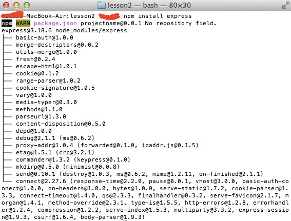
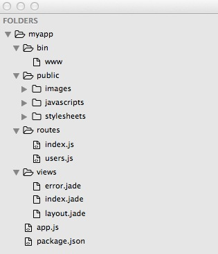

## 第二章 使用Node.js和Express开发一个基础网站

### 重点

* 了解Express
* 安装Express
* 管理路由
* 处理动态URLs和HTML表单
* 返回响应
* 日志系统

在之前的章节中，我们了解到常见的编程范式以及如何应用到Node.js，在这一章节中，我们将继续使用Express框架。这个框架是最流行以及可得到的框架之一。Express仍然广泛被使用部分开发者将他作为起点。

### 了解Express
Express[(http://expressjs.com/)](http://expressjs.com/)是Node.js专有的一个web框架。它建立在Connect[(http://www.senchalabs.org/connect/)](http://www.senchalabs.org/connect/)之上,这就意味着他是实现中间架构的。在之前的章节中，当我们研究Node.js时，我们会发现这种设计定案的好处：这种框架充当一种系统插件。也就是说，Express不但适合简单的也适合复杂的应用，这是因为的他的架构。我们也许只使用流行中间架构中的几种，或者添加一堆的详情和仍然保持应用模块。

普遍的，Node.js中的大部分项目呈现两种功能：运行监听标准端口的服务器和处理进来的请求。Express是一个包装器，对于这两种功能。如下：

```
var http = require("http");
http.createServer(function(req, res) {
	res.writeHead(200, {"Content-type": "text/plain"});
	res.end("Hello World\n");
}).listen(1337, "127.0.0.1");
console.log("Server running at http://127.0.0.1:1337/");
```

这是从Node.js官方文档中摘取下来的例子。如上所示，我们使用本地的http模块并运行在1337端口上的服务。有一个请求处理方法，这个方法简单的发送Hello world字符串到浏览器。现在，让我们相同的功能，使用Express框架，如下：

```
var express = require("express");
var app = express();
app.get("/", function(req, res, next) {
	res.send("Hello World\n");
}).listen(1337);
console.log("Server running at http://127.0.0.1:1337/");
```

这几乎是相同的事情。然而，我们并不需要响应头或者在结尾添加一新行字符串，因为框架已经帮我们做了这样的工作。此外，我们可以得到一大堆的中间架构，这些可以帮助我们更简单的处理请求。Express就像一个工具箱。我们有很多工具来做这些令人厌烦的工作，使我们注意力集中到应用的逻辑和内容上。Express的诞生就是通过提供好的功能为开发者节约时间。

### 安装Express

有两种方式来安装Express。我们先从简单的开始，然后继续到更先进的技术。简单方法产生的模板，我们也许使用这个模板开始直接写业务逻辑。同样的情况，这可以节约我们的时间。来自其他的观点，如果我们正在开发一个惯见的应用，我们需要用常见的设置。我们也可以使用模板，我们用先进的技术获取模板；这也许并不为我们工作。

#### 使用package.json

Express和其他模块一样。它在包得注册中有它自己的位置。如果我们想使用它，我们需要在package.json中添加框架。Node.js的生态系统是建立在Node Package Manager之上。它使用JSON文件找出我们所需要的，以及在当前目录安装它。因此我们的package.json文件内容看起来像下面的代码：

```
{
	"name": "projectname",
	"description": "description",
	"version": "0.0.1",
	"dependencies": {
		"express": "3.x"
	}
}
```

这些都是必须添加的。更精确的说，我们必须强调强制性的区域是name和version。然而，添加依赖和我们模块会好些，特别是如果我们想要在注册处发布我们工作，这些信息都是相当的重要。否则，其他的开发者将不知道我们的库正在做什么。当然，有一大堆的其他的区域，例如贡献者，关键字，或者开发依赖，我们将坚持有限的选项，因此我们聚焦在Express。
一旦我们有放置在项目文件夹里面的package.json文件，我们必须在可控制台调用npm install。通过这样，包管理器将创建一个node_modules文件夹以及存放Express和他的依赖。如下：



第三行像我们展示的是版本号，接下来的几行是Express所依赖的模块。现在，我们准备实验Express。如果我们打出require(“express”)，Node.js将开始寻找在本地node_modules目录里的库。因为我们不使用绝对路径，这是通常的习惯。如果我们没有运行npm install 命令行，我们将被Error: Cannot find module ‘express’提醒。

#### 使用命令行工具

有一个命令行工具被称为express-generator。一旦我们运行npm install -g express-generator，我们将安装它，并如同其他的命令行在我们的终端使用它。

如果你在几个项目中使用这个框架，你将会注意到重复的地方。我们甚至可以从一个应用中拷贝粘贴到另一个应用中，这是非常好的。我们也许甚至用我们自己的模板结束，以及常常从那个地方开始。Express的命令行版本做着相同的事情。它接受一些参数并基于它们，它为使用创建骨架。在有些案件中这将会非常的方便，并且将无疑节省时间。让我们看看下面可获取的参数：

+ -h, --help:这意味着输出包信息。
+ -v, --version:这显示Express版本。
+ -e, --ejs:这个参数添加EJS模板引擎支持。一般，我们需要一个库来处理我们的模板。写纯HTML是不现实的。默认引擎被设置为JADE。
+ -h, --hogan:这个参数是Hogan-enabled(另一个模板引擎)。
+ -c, --css:如果我们想使用css预处理器，这个选项将让我们使用LESS(Learner CSS的缩写)或者Stylus。默认是纯CSS。
+ -f, --force: 这个参数强制Express在一个非空目录运行。

让我们尝试用LESS作为一个CSS预处理器生成一个Express应用骨架。我们使用如下的命令：

```
express --css less myapp
```

一个新的myapp文件夹被创建以及文件结构，正如下面所看见的：



我们仍然需要安装依赖，因此 cd myapp $$ npm install 是必须的。我们现在跳过生成目录的说明，并将进入app.js编辑。从初始化依赖模块开始，如下：

```
var express = require('express');
var path = require('path');
var favicon = require('serve-favicon');
var logger = require('morgan');
var cookieParser = require('cookie-parser');
var bodyParser = require('body-parser');

var routes = require('./routes/index');
var users = require('./routes/users');

var app = express();
```

我们的框架是express，path 是一个本地的Node.js模块。中间架构是favicon，logger，cookieParser，和bodyParser。routes和users是客户端模块，被放置在本地项目文件夹中。类似的，就像在Model-View-Controller(MVC)设计模式中，这些事我们应用的控制器。很快，一个app变量被创建；这代表Express库。我们使用这个变量来识别我们的应用。通过设置一些key-value对，这个脚本持续着。下一代码片段定义了我们的视图和默认模板引擎的路径：

```
// view engine setup
app.set('views', path.join(__dirname, 'views'));
app.set('view engine', 'jade');
```

这个框架使用set和get方法定义内部属性。事实上，我们可以使用这些方法定义我们自己的变量。如果值是布尔类型，我们可以使用enable和disable重置set和get。如下：

```
app.set(‘color’, ‘red’);
app.set(‘color’); //red
app.enable(‘isAvailable’);
```

接下来的代码添加了中间架构到框架中。如下：

```
// uncomment after placing your favicon in /public
app.use(favicon(__dirname + '/public/favicon.ico'));
app.use(logger('dev'));
app.use(bodyParser.json());
app.use(bodyParser.urlencoded({ extended: false }));
app.use(cookieParser());
app.use(require('less-middleware')(path.join(__dirname, 'public')));
app.use(express.static(path.join(__dirname, 'public')));
```

第一个中间件充当应用的favicon。第二行负责在控制台中输出。如果我们删掉它，我们将不能得到来到我们服务器上请求的信息。

json和urlencoded中间件与伴随请求发送的数据相关。我们需要他们是因为他们将信息转换成容易使用的格式。同样，对于cookies也有一个中间件。它填充请求对象，因此我们稍后有权限获得这个数据。生成的app使用LESS作为一个css预处理，我们需要通过设置目录饱含.less.文件来识别它。我们将在第十章讨论LESS，编写灵活的、模块化的CSS，将详细的介绍。终究，我们定义了静态源，这应该通过服务器来传递。这仅仅的几行，我们就已经识别了整个应用。我们也许移除或删掉了一些模块，以及其他的继续起作用。地图文件中定义的两个路由到两个不同的处理器，代码如下：	

app.use('/', routes);
app.use('/users', users);

如果用户试图打开一个不存在的页面，Express仍然通过转发到错误处理来处理这个请求，如下：

```
// catch 404 and forward to error handler
app.use(function(req, res, next) {
    var err = new Error('Not Found');
    err.status = 404;
    next(err);
});
```
这个框架表明了两种类型的错误处理：开发环境和生产服务器。两者的不同在于后者隐藏掉错误的栈迹，栈迹应该只为应用的开发者所见。如我们所见如下的代码：我们正不同地校验env属性的值和处理错误。

```
// development error handler
// will print stacktrace
if (app.get('env') === 'development') {
    app.use(function(err, req, res, next) {
        res.status(err.status || 500);
        res.render('error', {
            message: err.message,
            error: err
        });
    });
}

// production error handler
// no stacktraces leaked to user
app.use(function(err, req, res, next) {
    res.status(err.status || 500);
    res.render('error', {
        message: err.message,
        error: {}
    });
});
```

最后，app.js文件大哦哦出创建了的Express变量，如下：

```
module.exports = app;
```

运行application，我们需要执行 **node ./bin/www** 这个代码app.js所需要的和开始服务器，通过默认监听3000端口。

```
#!/usr/bin/env node

/**
 * Module dependencies.
 */

var app = require('../app');
var debug = require('debug')('myapp:server');
var http = require('http');

/**
 * Get port from environment and store in Express.
 */

var port = parseInt(process.env.PORT, 10) || 3000;
app.set('port', port);

/**
 * Create HTTP server.
 */

var server = http.createServer(app);
```

process.evn申明提供一个访问定义在当前开发环境的变量的权限。如果没有port的设置，Express使用3000作为值。所需的debug模块使用一个类似的途径来找出它是否有必要在控制台显示信息。

### 路由管理


